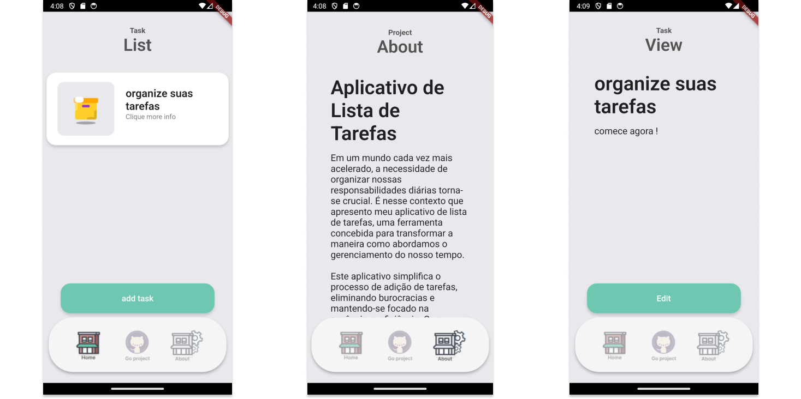

# Flex Task List - Organize suas Tarefas com Facilidade

#### acesso rapido

- [Download do app flex task list v1.3](https://github.com/marco0antonio0/App-Task-List/releases/tag/v1.3)
- [Privacy policy](/privacy%20policy.md)

Em um mundo cada vez mais acelerado, a necessidade de organizar nossas responsabilidades diárias torna-se crucial. É nesse contexto que apresento meu aplicativo de lista de tarefas, o **Flex Task List**. Desenvolvido em Flutter e fundamentado em conceitos sólidos de arquitetura MVC (Model-View-Controller), este aplicativo une a elegância do design clean com a eficiência da persistência de dados usando SQFlite, proporcionando uma experiência única no gerenciamento de tarefas.

## Design Clean para uma Experiência Descomplicada

O **Flex Task List** é guiado pelo princípio do design clean, visando oferecer uma experiência descomplicada. A interface intuitiva permite que você adicione tarefas com facilidade, mantendo o foco no que realmente importa.

## Arquitetura MVC para uma Organização Estruturada

A adoção da arquitetura MVC contribui para uma organização estruturada do código-fonte, promovendo a separação de preocupações entre o Modelo (Model), a Visão (View) e o Controlador (Controller). Isso não apenas facilita a manutenção do código, mas também melhora a escalabilidade do aplicativo.

## Características Principais

### Persistência de Dados com SQFlite

A utilização da biblioteca SQFlite garante que suas tarefas permaneçam acessíveis mesmo após fechar o aplicativo. Essa abordagem robusta possibilita uma experiência contínua, permitindo que você retome suas atividades sem preocupações.

### Visualização Clara e Organizada

A interface limpa do aplicativo proporciona uma visualização clara de suas tarefas. Obtenha uma compreensão rápida e abrangente do que precisa ser feito, permitindo que você mantenha o foco nas suas prioridades.

## Exclusividade para Android

Desenvolvido exclusivamente para a plataforma Android, o **Flex Task List** se integra perfeitamente ao ecossistema do sistema operacional. Isso resulta em uma experiência fluida e intuitiva, alinhada com os padrões e convenções da plataforma.

## Experimente Agora no Github

Transforme a gestão do seu tempo e simplifique sua vida com o **Flex Task List**. Baixe agora na [Github apps](https://github.com/marco0antonio0/App-Task-List/releases/tag/v1) e descubra uma forma eficiente de organizar suas tarefas.

**Desenvolvedor:**

- Marco A. da S. Mesquita

**Web Design:**

- Marco A. da S. Mesquita
- Alexsandro F. Nascimento
- Beatriz S. Lisboa

**Modelagem banco de dados e regra de negocio:**

- Marco A. da S. Mesquita
- Jean A. Dias

**Code review:**

- Alexsandro F. Nascimento
- Beatriz S. Lisboa
